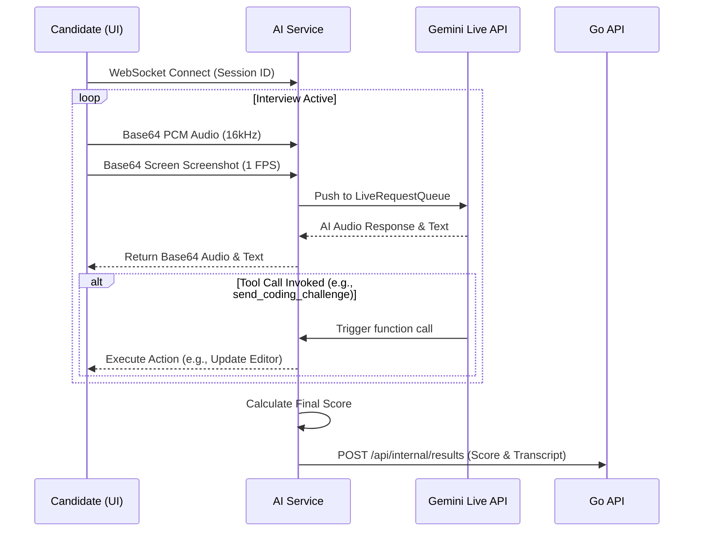

# Clair AI - AI Service

The AI service powers the core conversational logic of Clair using the **Google ADK** and the **Gemini Live API**. It acts as a bridge between the candidate's browser (via WebSockets) and the Gemini model, facilitating real-time bidirectional audio streaming, screen observation, and tool invocation.

## Architecture & Responsibilities

1.  **WebSocket Server (`main.py`)**: Uses FastAPI to expose WebSocket endpoints `/{session_id}`. It receives base64-encoded audio and screen frames from the UI, and sends back AI-generated audio and text.
2.  **Bidirectional Audio Streaming**: Manages the `LiveRequestQueue` from Google ADK, pushing user audio continuously and handling AI speech generation.
3.  **Audio Gating**: Contains logic to mute user audio during tool calls to prevent race conditions with the Gemini API (e.g., error 1008 policy violations).
4.  **Interview Agent (`interview_agent/`)**:
    *   `agent.py`: Defines the `google.adk.agents.Agent` instance, binding the personality, instructions, and tools to the `gemini-2.5-flash-preview-native-audio-dialog` model.
    *   `prompts.py`: Contains the system instructions that give Clair her distinct, senior-engineer persona (e.g., natural speaking style, using fillers, adapting to the candidate's stack).
    *   `tools.py`: Wraps functions like `send_coding_challenge`, `observe_screen`, and `end_interview` so the agent can interact with the environment.
6.  **Webhook Integration (`services/webhook.py`)**: Responsible for securely posting the final score report and interview transcript back to the Go API when the interview concludes.

### Data Flow Diagram



## Directory Structure

```text
ai/
├── main.py                  # FastAPI app, WebSocket server, streaming loops
├── config.py                # Pydantic settings loading from .env
├── requirements.txt         # Python dependencies
├── Dockerfile               # Production container definition
├── cloudbuild.yaml          # CI/CD pipeline definition for GCP
├── interview_agent/         # Core agent logic and persona
│   ├── agent.py             # ADK Agent setup
│   ├── prompts.py           # System instructions
│   └── tools.py             # Agent tools (coding, screen observation, scoring)
├── models/                  # Pydantic data models for internal use
└── services/
    └── webhook.py           # Posts results to the API service
```

## Local Development Context

### Prerequisites
*   Python 3.12+
*   A valid `GOOGLE_API_KEY` (Gemini API)
*   The API service running locally (for webhooks to work)

### Setup & Run
1.  Create and activate a virtual environment:
    ```bash
    python -m venv venv
    source venv/bin/activate
    ```
2.  Install dependencies:
    ```bash
    pip install -r requirements.txt
    ```
3.  Configure environment variables:
    ```bash
    cp .env.example .env
    # Edit .env with your Google API Key and internal dev keys
    ```
4.  Run the application locally:
    ```bash
    fastapi dev main.py --port 8001
    ```

## Environment Variables Reference

| Variable | Description | Default Local Value |
|----------|-------------|---------------------|
| `GOOGLE_API_KEY` | Gemini API key from AI Studio | (Required) |
| `GOOGLE_GENAI_USE_VERTEXAI` | Whether to route requests through Vertex AI | `FALSE` |
| `GOLANG_BACKEND_URL` | Base URL of the Go API | `http://localhost:3000` |
| `INTERNAL_API_KEY` | Key for authenticated requests to the Go API | `clair-ai-dev-key` |
| `AGENT_MODEL` | The specific Gemini model version | `gemini-2.5-flash-preview-native-audio-dialog` |

## Developer Onboarding & Mental Model

If you are new to this codebase, here is the mental model of how the AI Service operates:

**1. The `LiveRequestQueue` is the heart of the system**
We use `google.adk.runners.Runner.run_live()` which abstracts away the raw WebRTC/WebSocket details of the Gemini Live API. Instead, we push user audio/frames into a `LiveRequestQueue`, and the ADK handles sending it to Gemini and receiving the AI's response callbacks.

**2. Gating Audio is Critical (The "Race Condition")**
If the user speaks (or background noise is sent) at the exact millisecond the AI is executing a tool call (like `send_coding_challenge`), the Gemini Live API will throw a `1008 Policy Violation` and crash the connection. **See `main.py`**: We actively pause the `AudioProcessor` while tool calls are executing.

**3. "Clair" is just a Prompt + Tools**
The entire persona is defined in `interview_agent/prompts.py`. If you need to make Clair more strict, more lenient, or ask different questions, you edit the prompt. If you need her to do something new (like send a database schema to the UI), you write a new Python function in `interview_agent/tools.py` and register it in `agent.py`.

### Common Tasks
*   **Modifying prompt behavior**: Edit `interview_agent/prompts.py` to change how Clair speaks or assesses candidates.
*   **Adding a new capability**: Create a function in `interview_agent/tools.py`, annotate it properly, and add it to the `tools` list in `agent.py`.
*   **Debugging WebSockets**: Look at the `websocket_endpoint` in `main.py`. This is where base64 decoding happens before data hits the AI.
