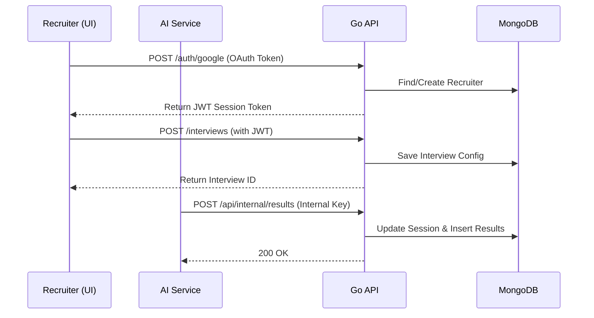

# Clair AI - API Service

This directory contains the core backend API for Clair. Built with **Go 1.25** and the **Fiber v2** web framework, it acts as the central source of truth for the platform, managing users, interview sessions, and final score reporting.

## Architecture & Responsibilities

1.  **Authentication Control**: Provides Google OAuth flow for recruiters to log in, and manages JWT issuance and validation for API access.
2.  **Entity Management**: Handles CRUD operations for `Interviews` (the job definition) and `Sessions` (the unique instance of an interview for a specific candidate).
3.  **Data Persistence**: Uses a MongoDB driver to interact with the database. In production, this targets Google Cloud **Firestore in Datastore mode** (via its MongoDB compatibility layer).
4.  **Service-to-Service Communication**: Exposes protected webhooks that the Python AI service calls to deposit the final interview results (`/api/internal/results`). This is secured using an internal API key.

### Data Flow Diagram



## Directory Structure

```text
api/
├── main.go                  # Application entry point and Fiber app initialization
├── go.mod / go.sum          # Go module dependencies
├── Dockerfile               # Production container definition
├── cloudbuild.yaml          # CI/CD pipeline definition for GCP
├── config/                  # Configuration loaders (env vars)
├── database/                # MongoDB connection and client initialization
├── handlers/                # Request handlers (controllers)
│   ├── auth.go              # Google OAuth and JWT generation
│   ├── interview.go         # Interview CRUD logic
│   ├── session.go           # Session creation and validation
│   └── webhook.go           # Internal endpoints for the AI service
├── middleware/              # Fiber middleware (e.g., JWT auth, internal auth)
├── models/                  # BSON/JSON structs defining the data schema
└── routes/                  # API route definitions and groupings
```

## Local Development Context

### Prerequisites
*   Go 1.25+
*   A local MongoDB instance (or rely on the `docker-compose.yml` in the project root)
*   Google OAuth Client Credentials (for the login flow)

### Setup & Run
1.  Navigate to the `api` directory and install dependencies:
    ```bash
    go mod download
    ```
2.  Set up your environment variables:
    ```bash
    cp .env.example .env
    # Edit .env with your specific secrets, OAuth credentials, and DB URI.
    ```
3.  Start the Fiber server:
    ```bash
    go run main.go
    ```
    The server will start on port `3000` by default.

## Environment Variables Reference

| Variable | Description | Default Local Value |
|----------|-------------|---------------------|
| `PORT` | The port the Go server listens on | `3000` |
| `GOOGLE_CLIENT_ID` | OAuth Client ID for Recruiter Login | (Required) |
| `GOOGLE_CLIENT_SECRET` | OAuth Client Secret | (Required) |
| `JWT_SECRET` | Secret string for signing session JWTs | `clair-ai-dev-secret` |
| `MONGO_URI` | Connection string for MongoDB | `mongodb://localhost:27017/clair_ai` |
| `INTERNAL_API_KEY` | Shared secret to authorize requests from the AI service | `clair-ai-dev-key` |
| `FRONTEND_URL` | Base URL of the UI (used for CORS and OAuth redirects) | `http://localhost:8080` |

## Developer Onboarding & Mental Model

If you are new to this codebase, here is the mental model of how the API Service operates:

**1. We use Go Fiber (Express.js style)**
If you are coming from Node.js/Express, the `gofiber/fiber/v2` framework will feel very familiar. Handlers take a `*fiber.Ctx` context object, parse JSON bodies via `c.BodyParser()`, and return JSON via `c.JSON()`.

**2. No ORM, direct MongoDB BSON**
We do not use a heavy ORM (like GORM). Instead, we use the official MongoDB Go Driver. You'll see direct `bson.M{}` and `bson.D{}` queries in the handlers. Ensure your structs in `models/` have accurate `` bson:"field_name" `` tags.

**3. Two Layers of Auth**
*   **Recruiter UI Auth**: Handled via JWTs. See `middleware/require_auth.go`. The UI sends a Bearer token.
*   **Service-to-Service Auth**: The AI Service needs to submit scores securely. We don't use JWTs for this; we use a static, shared secret (`INTERNAL_API_KEY`). See `middleware/require_internal_auth.go` and `handlers/webhook.go`.

### Common Tasks
*   **Adding a new endpoint**: 
    1. Define the handler function in `handlers/<topic>.go`.
    2. Register the path in `routes/routes.go`.
    3. Apply the `middleware.RequireAuth` if it represents user data.
*   **Modifying schema**: Update the structs in `models/` and ensure the BSON and JSON tags match your frontend expectations and database requirements.
