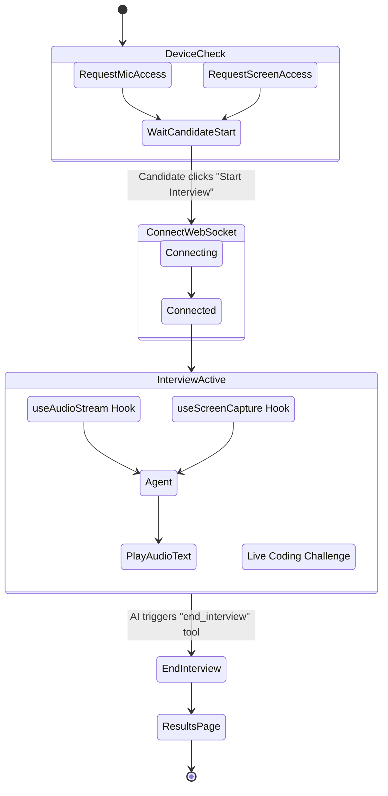

# Clair AI - UI Service

The frontend for Clair is a **React 19** application built with **TypeScript** and bundled using **Vite**. It provides two distinct experiences: the Recruiter Dashboard for managing interviews, and the Candidate Interface for the immersive, real-time voice interview.

## Architecture & Key Workflows

1.  **Recruiter Dashboard**: 
    *   Authenticates via Google OAuth (communicating with the Go API).
    *   Allows creating interview templates and generating unique session links for candidates.
    *   Displays detailed score reports and transcripts for completed interviews.
2.  **Candidate Interview Room**:
    *   Connects to the Python AI service via **WebSockets**.
    *   **Audio Streaming**: Captures the candidate's microphone audio via the `AudioContext` API, downsamples it to 16kHz PCM, encodes it to base64, and streams it over the WebSocket. It also receives, decodes, and plays back the AI's audio in real time.
    *   **Screen Observation**: Periodically captures the candidate's screen or specific window using the Screen Capture API and sends frames to the AI service for Gemini Vision processing.
    *   **Live Coding**: Embeds the Monaco Editor for technical challenges, syncing the code state so the AI can evaluate it.

### Candidate Experience Flow



## Directory Structure

```text
ui/
├── index.html               # Main HTML entry point
├── package.json             # NPM dependencies and scripts
├── vite.config.ts           # Vite configuration
├── Dockerfile               # Production container definition
├── cloudbuild.yaml          # CI/CD pipeline definition for GCP
└── src/
    ├── api/                 # Axios clients and API communication logic
    ├── components/          # Reusable UI elements (MUI wrappers, Layouts)
    │   ├── interview/       # Components specific to the interview room (Editor, Chat)
    │   └── common/          # Shared components (Buttons, Loaders, Modals)
    ├── context/             # Global React Contexts (AuthContext, SetupContext)
    ├── hooks/               # Custom React Hooks
    │   ├── useAudioStream.ts  # Logic for capturing and streaming microphone audio
    │   ├── useWebSocket.ts    # Logic for managing the WebSocket connection to the AI service
    │   └── useScreenCapture.ts# Logic for acquiring and polling screen frames
    ├── pages/               # Top-level route components
    │   ├── DashboardPage.tsx  # Recruiter Home
    │   ├── InterviewPage.tsx  # The actual live interview screen
    │   └── ResultsPage.tsx    # detailed view of a completed interview
    ├── theme/               # Material UI theme definitions
    └── utils/               # Helper functions (audio conversion, token formatting)
```

## Local Development Context

### Prerequisites
*   Node.js (v20+ recommended)
*   The Go API running locally (for authentication and data fetching)
*   The Python AI Service running locally (for the WebSocket connection)

### Setup & Run
1.  Navigate to the `ui` directory and install dependencies:
    *(we recommend using `pnpm` based on the existence of `pnpm-lock.yaml`, but `npm` works too)*
    ```bash
    pnpm install
    # or npm install
    ```
2.  Set up environment variables:
    ```bash
    cp .env.example .env
    ```
3.  Start the development server:
    ```bash
    pnpm run dev
    # or npm run dev
    ```
    The application will be available at `http://localhost:8080` (configured in `vite.config.ts`).

## Environment Variables Reference

| Variable | Description | Default Local Value |
|----------|-------------|---------------------|
| `VITE_API_URL` | Base URL for the Go API | `http://localhost:3000` |
| `VITE_WS_URL` | WebSocket URL for the Python AI Service | `ws://localhost:8001` |

## Developer Onboarding & Mental Model

If you are new to this codebase, here is the mental model of how the UI Service operates:

**1. Separation of Responsibilities (Recruiter vs. Candidate)**
The app serves two completely different personas. `DashboardPage` and `ResultsPage` are standard CRUD React views fetching data via Axios from the Go API. `InterviewPage`, however, is a complex, real-time WebSocket client that speaks exclusively to the Python AI service.

**2. The Web Audio API Context**
The most complex part of the frontend is audio processing in `hooks/useAudioStream.ts`. We capture the mic using `navigator.mediaDevices.getUserMedia()`, pass it through an `AudioContext`, use a `ScriptProcessorNode` (or AudioWorklet) to grab raw Float32 data, downsample it from 48kHz (browser default) to 16kHz, convert to PCM16, encode to Base64, and ship it over the WebSocket. 

**3. The Screen Capture Loop**
Unlike WebRTC video streaming, we use a simple polling mechanism in `hooks/useScreenCapture.ts`. We grab an image of the DOM or the screen buffer once every second (1 FPS), convert it to a JPEG Base64 string, and send it to the AI.

### Common Tasks
*   **Adjusting Audio Quality**: Modify the downsampling and PCM formatting logic inside `src/hooks/useAudioStream.ts`. If audio sounds robotic, check the ArrayBuffer endianness.
*   **Styling**: The app heavily relies on Material UI (`@mui/material`). Theme configurations (colors, typography) are centralized to ensure a consistent look and feel rather than using custom CSS classes.
*   **Adding a new Editor Language**: Update the generic `MonacoEditor` component to support new syntax highlighting or themes.
